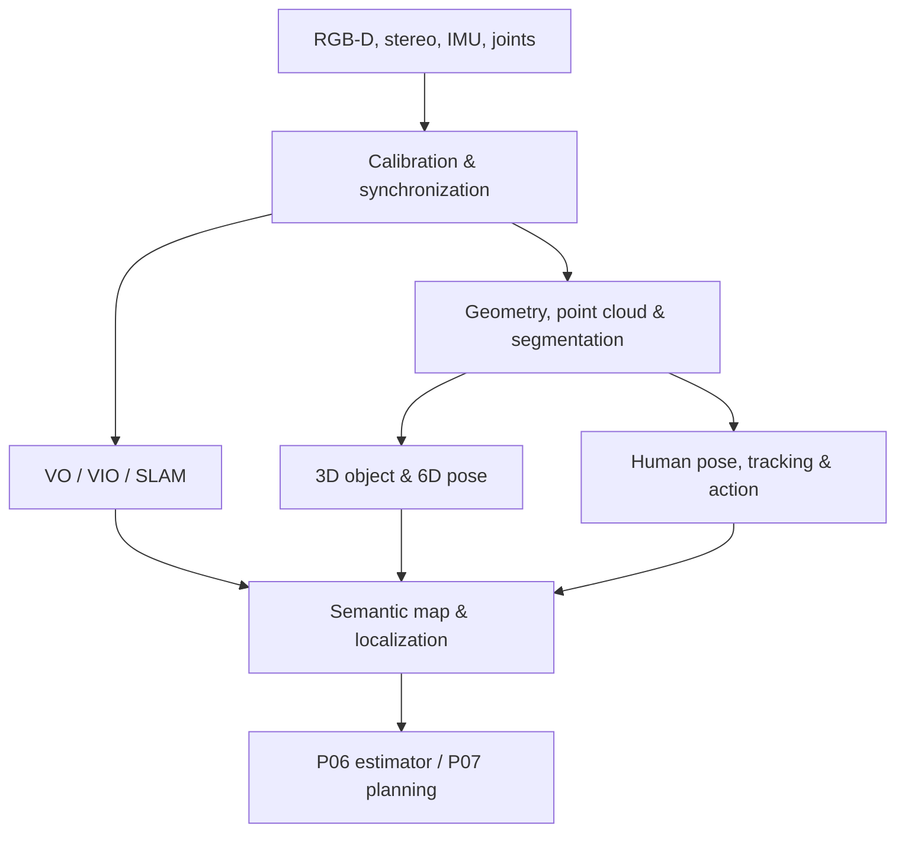

# P05 — Humanoid 3D Perception, SLAM & Human Understanding

## 1. Thông tin project

- **Mã project:** P05
- **Tên project:** Humanoid 3D Perception, SLAM & Human Understanding
- **Thời gian:** Tuần 29–36, từ **29/03/2027 đến 23/05/2027**
- **Hướng phát triển:** Humanoid AI Perception kết hợp Humanoid Robot Localization & Simulation
- **Thành viên A:** Camera geometry, 3D perception, segmentation, 6D object pose, Visual/Visual-Inertial SLAM và human understanding
- **Thành viên B:** Sensor/TF integration, ground-truth simulation, localization fusion, ROS 2 runtime và state/map handoff
- **Điểm xuất phát:** Kế thừa robot/sensor model từ P01, perception/state infrastructure từ P02, semantic scene graph từ P03 và data/model/runtime conventions từ P04.

## 2. Mục tiêu, phạm vi và tiêu chí kết thúc

### 2.1. Project giải quyết vấn đề gì?

P05 xây dựng hệ thống giúp humanoid hiểu không gian 3D và con người xung quanh thay vì chỉ nhận biết từng khung hình. Hệ thống phải hiệu chỉnh camera, khôi phục geometry, xử lý point cloud, ước lượng chuyển động camera, xây semantic map, xác định 6D pose của vật thể và theo dõi pose/hành động của con người theo thời gian.

P05 chưa điều khiển bước đi. Simulator phát lại các trajectory camera/base đã biết để tách bài toán perception/localization khỏi locomotion. Kết quả cuối là các interface ổn định về `map → odom → base_link`, semantic objects và human states để P06 thực hiện floating-base state estimation và P07 thực hiện locomotion.

### 2.2. Công dụng trong humanoid robot

- Xác định robot đang ở đâu và camera đang nhìn theo hướng nào.
- Xây bản đồ hình học và semantic map của môi trường.
- Nhận biết vật thể trong 3D, ước lượng vị trí và orientation phục vụ manipulation.
- Nhận biết người, skeleton, chuyển động và hành động phục vụ human-aware planning.
- Duy trì identity của người/vật thể qua nhiều frame và qua che khuất ngắn.
- Cung cấp covariance, freshness và confidence để control không sử dụng perception như ground truth tuyệt đối.

### 2.3. Input tổng thể

| Input | Interface | Tần số | Frame/đơn vị |
|---|---|---:|---|
| Head RGB | `/head_camera/color/image_raw`, `sensor_msgs/msg/Image` | 20 Hz | `head_camera_optical_frame` |
| Head depth | `/head_camera/depth/image_raw`, `sensor_msgs/msg/Image` | 20 Hz | mét, optical frame |
| Stereo pair | left/right `sensor_msgs/msg/Image` | 20 Hz | calibrated stereo frames |
| Camera info | `sensor_msgs/msg/CameraInfo` | 20 Hz | intrinsic/distortion/extrinsic |
| IMU | `/imu/data`, `sensor_msgs/msg/Imu` | 200 Hz | `imu_link`, SI |
| Joint state | `/joint_states`, `sensor_msgs/msg/JointState` | 100 Hz | rad, rad/s, N·m |
| P02 tracks | `p02_interfaces/msg/TrackedObjectArray` | 15 Hz | `base_link`, SI |
| P03 scene graph | `p03_interfaces/msg/SceneGraph` | 10–15 Hz | semantic objects/relations |
| Simulation ground truth | evaluator-only pose/object/human state | 100 Hz | `world`, SI |

### 2.4. Output tổng thể

| Output | Interface/artifact | Nội dung |
|---|---|---|
| Calibration | YAML + `/camera_info` | intrinsics, distortion, stereo/hand–eye extrinsics và uncertainty |
| Odometry | `/localization/visual_odom`, `nav_msgs/msg/Odometry` | camera/base pose, twist và covariance |
| Fused localization | `/localization/state`, `p05_interfaces/msg/LocalizationEstimate` | map/odom/base pose, covariance, status và age |
| Point cloud | `/perception/cloud_registered`, `sensor_msgs/msg/PointCloud2` | filtered/registered RGB-D cloud |
| 3D object | `/perception/objects_3d`, `SemanticObject3DArray` | class, mask, 3D bbox, 6D pose, covariance và track ID |
| Human state | `/perception/humans`, `HumanStateArray` | person ID, 2D/3D keypoints, velocity, action và uncertainty |
| Semantic map | `/mapping/semantic_map`, `SemanticMap` | map pose, object landmarks, occupancy/voxel reference và version |
| Reports | `docs/verification.md` | calibration, geometry, SLAM, object và human metrics |

### 2.5. Module sử dụng kết quả

- P06 dùng localization, IMU, joint/contact measurements và covariance để ước lượng floating-base state.
- P07 dùng semantic/occupancy map, human tracks và terrain/object geometry cho planning và locomotion.
- P03/P04 có thể dùng 6D object pose và human intent để nâng cấp grounding, manipulation và VLA observations.
- Safety supervisor dùng human position/velocity/action uncertainty để quyết định speed scale hoặc stop.

### 2.6. Phạm vi bắt buộc

- Monocular/stereo/RGB-D camera calibration và hand–eye transform trong simulation.
- Feature matching, epipolar geometry, PnP và pose-estimation baseline.
- Point-cloud filtering, normals, registration và RGB-D integration.
- Semantic/instance segmentation và một promptable-segmentation baseline.
- PointNet/PointNet++ learning baseline cho point clouds.
- 6D object pose theo BOP-style evaluation.
- Visual Odometry và ít nhất một RGB-D hoặc Visual-Inertial SLAM pipeline.
- 2D/3D human pose, multi-person tracking/Re-ID và action recognition baseline.
- ROS 2 localization, TF và semantic-map interfaces có covariance/freshness.

### 2.7. Ngoài phạm vi

- Không walking controller, footstep planner hoặc dynamic balance; thuộc P07.
- Không floating-base/contact estimator hoàn chỉnh; thuộc P06.
- Không triển khai sensor thật, TensorRT hoặc hardware synchronization; thuộc P08.
- Không tự huấn luyện foundation segmentation/pose model từ đầu.
- Không dùng simulator ground truth làm runtime model input.
- Không nhận diện danh tính cá nhân; person ID chỉ là anonymous track ID trong một run.

### 2.8. Điều kiện bắt đầu

- P01–P04 interfaces build được và simulator publish đúng RGB-D, IMU, joint state và TF.
- Camera frames tuân thủ optical-frame convention; timestamps dùng cùng simulation clock.
- Có calibration target, object meshes, human actor và repeatable sensor trajectories.
- Dataset/checkpoint bytes lưu ngoài Git; manifest và license được kiểm soát.

### 2.9. Tiêu chí kết thúc

- Monocular reprojection RMSE ≤0.5 px; stereo epipolar vertical error median ≤0.5 px.
- Point-cloud registration fitness và RMSE được báo cáo; map không chứa NaN/Inf và frame consistency pass.
- Visual/RGB-D odometry ATE RMSE ≤0.10 m trên nominal simulation trajectory; không dùng ground truth làm input.
- Segmentation đạt mIoU hoặc mask AP gate đã khóa theo dataset; không báo accuracy thay thế.
- 6D pose dùng BOP-compatible metric và đạt threshold riêng cho từng object symmetry group.
- 2D human pose, tracking và action recognition đều có metric độc lập; track ID không chứa thông tin định danh thật.
- Localization/map/human/object outputs có timestamp, frame, covariance hoặc confidence và stale status.
- Unit, integration và system tests pass; có report, map artifact, trajectory plot và video demo.

### 2.10. Kế thừa và bàn giao

| Kế thừa từ P01–P04 | P05 bổ sung | Bàn giao cho P06–P07 |
|---|---|---|
| Camera/IMU/TF simulation | Calibration và hand–eye transforms | Verified sensor extrinsics |
| 2D detection, depth, tracks | Point cloud, segmentation, 3D bbox và 6D pose | 3D objects with uncertainty |
| KF/EKF và robot state | VO/VIO/SLAM localization | Pose/twist/covariance and status |
| Semantic scene graph | Persistent semantic map | Map landmarks and human-aware context |
| P04 data/runtime conventions | 3D/human datasets and benchmark | Reusable manifests and ROS contracts |

## 3. Architecture



### 3.1. Module và failure behavior

| Module | Input | Output | Failure behavior |
|---|---|---|---|
| `calibration` | target observations | intrinsics/extrinsics/covariance | Reject insufficient views, high RMSE hoặc degenerate poses |
| `geometry` | calibrated images/matches | E/F matrix, depth, pose | RANSAC reject outliers; không publish pose nếu inlier thấp |
| `pointcloud` | RGB-D/camera info | filtered/registered cloud | Remove invalid depth; frame mismatch làm drop cloud |
| `segmentation` | RGB image/text/boxes | masks/classes/scores | Model failure dùng classical/P02 mask fallback hoặc mark unavailable |
| `object3d` | mask, cloud, mesh | 3D bbox/6D pose | Symmetry-aware score; low confidence không thành landmark |
| `odometry` | images/depth/IMU | relative pose/twist/covariance | Lost tracking publish degraded/lost state, không giữ pose như fresh |
| `slam` | odometry/features/depth | map pose, keyframes/map | Relocalize khi có thể; reset chỉ qua explicit policy |
| `human` | image/depth | pose, track, action | Occlusion tăng uncertainty; không đoán identity |
| `semantic_map` | localization + objects/humans | versioned map | Reject out-of-order update; dynamic humans không ghi thành static landmark |
| `evaluation` | predictions + evaluator ground truth | metrics/report | Missing ground truth ghi `not_evaluable` |

### 3.2. Interface Perception ↔ Localization/Control

```yaml
topic: /localization/state
type: p05_interfaces/msg/LocalizationEstimate
rate: 30 Hz
message:
  header:
    frame_id: map
    stamp_ns: 32000000000
  child_frame_id: base_link
  position_m: [1.42, -0.37, 0.89]
  orientation_xyzw: [0.0, 0.0, 0.13, 0.991]
  linear_velocity_mps: [0.18, 0.01, 0.0]
  covariance_diag: [0.006, 0.007, 0.010, 0.012, 0.012, 0.018]
  status: TRACKING
  source: RGBD_IMU
  age_ms: 18
```

```yaml
topic: /perception/humans
type: p05_interfaces/msg/HumanStateArray
rate: 15 Hz
human:
  track_id: 23
  pose_frame: map
  pelvis_position_m: [2.10, 0.54, 0.96]
  velocity_mps: [-0.22, 0.02, 0.0]
  keypoint_count: 17
  action: approaching
  action_confidence: 0.84
  pose_confidence: 0.91
  age_ms: 34
```

### 3.3. Coordinate-frame policy

- `head_camera_optical_frame`: camera measurements, optical convention.
- `base_link`: robot-relative short-range objects.
- `odom`: locally continuous pose; không nhảy khi loop closure.
- `map`: globally corrected pose; có thể thay đổi khi loop closure.
- Static object landmarks lưu trong `map`; dynamic humans giữ pose kèm timestamp/velocity và không được fuse như static map.
- Mọi transform lookup có timestamp và timeout; không dùng latest transform mặc định để che lỗi synchronization.

### 3.4. Logging, configuration và testing

- Mỗi frame bundle có `sequence_id`; mỗi localization/map run có `run_id` và config hash.
- Log JSONL chứa source timestamps, transform age, model ID, latency, quality/confidence và failure state.
- Calibration, datasets, models và maps có version/checksum; không overwrite artifact mà không tăng version.
- Unit tests kiểm tra algorithms/contracts; integration tests kiểm tra ROS/TF/data flow; system tests dùng locked trajectories và seeds.

## 4. Cấu trúc repository chuyên nghiệp

```text
p05_humanoid_3d_perception_slam_human_understanding/
├── README.md
├── LICENSE
├── CONTRIBUTING.md
├── pyproject.toml
├── requirements.lock
├── .editorconfig
├── .gitignore
├── .pre-commit-config.yaml
├── .github/
│   └── workflows/
│       └── ci.yaml
├── docs/
│   ├── architecture.md
│   ├── interfaces.md
│   ├── calibration_protocol.md
│   ├── coordinate_frames.md
│   ├── model_selection.md
│   ├── privacy_and_safety.md
│   ├── verification.md
│   └── runbook.md
├── configs/
│   ├── system.yaml
│   ├── calibration.yaml
│   ├── geometry.yaml
│   ├── pointcloud.yaml
│   ├── segmentation.yaml
│   ├── object_pose.yaml
│   ├── slam.yaml
│   ├── human_understanding.yaml
│   └── simulation.yaml
├── calibration/
│   ├── camera_intrinsics.yaml
│   ├── stereo_extrinsics.yaml
│   └── head_camera_to_base.yaml
├── data/
│   ├── README.md
│   ├── dataset_manifest.json
│   ├── split_manifest.json
│   ├── class_map.yaml
│   └── sequence_catalog.yaml
├── models/
│   ├── README.md
│   └── registry.json
├── maps/
│   ├── README.md
│   └── registry.json
├── src/
│   └── p05_core/
│       ├── __init__.py
│       ├── config.py
│       ├── contracts.py
│       ├── errors.py
│       ├── logging.py
│       ├── calibration/
│       │   ├── __init__.py
│       │   ├── intrinsics.py
│       │   ├── stereo.py
│       │   └── hand_eye.py
│       ├── geometry/
│       │   ├── __init__.py
│       │   ├── features.py
│       │   ├── epipolar.py
│       │   ├── pose.py
│       │   └── triangulation.py
│       ├── pointcloud/
│       │   ├── __init__.py
│       │   ├── processing.py
│       │   ├── registration.py
│       │   └── integration.py
│       ├── perception/
│       │   ├── __init__.py
│       │   ├── segmentation.py
│       │   ├── pointnet.py
│       │   ├── object3d.py
│       │   └── pose6d.py
│       ├── localization/
│       │   ├── __init__.py
│       │   ├── visual_odometry.py
│       │   ├── visual_inertial.py
│       │   ├── slam_adapter.py
│       │   └── fusion.py
│       ├── humans/
│       │   ├── __init__.py
│       │   ├── pose.py
│       │   ├── tracking.py
│       │   ├── action.py
│       │   └── intent.py
│       ├── mapping/
│       │   ├── __init__.py
│       │   ├── semantic_map.py
│       │   └── persistence.py
│       └── evaluation/
│           ├── __init__.py
│           ├── metrics.py
│           ├── trajectory.py
│           └── report.py
├── ros2_ws/
│   └── src/
│       ├── p05_interfaces/
│       │   ├── CMakeLists.txt
│       │   ├── package.xml
│       │   └── msg/
│       │       ├── LocalizationEstimate.msg
│       │       ├── SemanticObject3D.msg
│       │       ├── SemanticObject3DArray.msg
│       │       ├── HumanState.msg
│       │       ├── HumanStateArray.msg
│       │       └── SemanticMap.msg
│       ├── p05_runtime/
│       │   ├── package.xml
│       │   ├── setup.py
│       │   └── p05_runtime/
│       │       ├── pointcloud_node.py
│       │       ├── object3d_node.py
│       │       ├── localization_node.py
│       │       ├── human_understanding_node.py
│       │       └── semantic_map_node.py
│       ├── p05_fusion/
│       │   ├── CMakeLists.txt
│       │   ├── package.xml
│       │   ├── include/p05_fusion/localization_fusion.hpp
│       │   └── src/localization_fusion.cpp
│       └── p05_bringup/
│           ├── package.xml
│           └── launch/perception_slam.launch.py
├── simulation/
│   ├── gazebo/
│   │   ├── world.sdf
│   │   ├── calibration_targets.sdf
│   │   └── human_actors.sdf
│   └── scenarios/
│       ├── calibration.yaml
│       ├── mapping_nominal.yaml
│       ├── low_texture.yaml
│       ├── dynamic_humans.yaml
│       ├── occlusion.yaml
│       └── sensor_dropout.yaml
├── tools/
│   └── p05.py
├── tests/
│   ├── unit/
│   │   ├── test_calibration.py
│   │   ├── test_geometry.py
│   │   ├── test_pointcloud.py
│   │   ├── test_perception3d.py
│   │   ├── test_localization.py
│   │   ├── test_humans.py
│   │   └── test_mapping.py
│   ├── integration/
│   │   ├── test_sensor_localization.py
│   │   ├── test_localization_mapping.py
│   │   └── test_perception_humans.py
│   └── system/
│       └── test_scenarios.py
└── deploy/
    ├── Dockerfile
    └── compose.yaml
```

### 4.1. Trách nhiệm của từng file và folder

| Đường dẫn | Trách nhiệm trong sản phẩm |
|---|---|
| `README.md` | Cài đặt, build, lấy model/data, calibrate, run, evaluate và tái tạo demo. |
| `LICENSE` | Quyền sử dụng/phân phối code. |
| `CONTRIBUTING.md` | Quy ước code, config, calibration, map/model/data changes và tests. |
| `pyproject.toml` | Python package, CLI, dependency, formatter, type checker và pytest. |
| `requirements.lock` | Khóa dependency tái lập. |
| `.editorconfig` | Chuẩn encoding, indent và newline. |
| `.gitignore` | Loại raw data, checkpoints, maps, rosbags, logs, videos và ROS build. |
| `.pre-commit-config.yaml` | Format, lint, schema và secret checks. |
| `.github/workflows/ci.yaml` | Build Python/ROS packages, schema checks và automated tests. |
| `docs/architecture.md` | Module, data flow, deployment và failure states. |
| `docs/interfaces.md` | Topic/message fields, frame, unit, rate, QoS và timeout. |
| `docs/calibration_protocol.md` | Target, pose coverage, procedure, acceptance metric và versioning. |
| `docs/coordinate_frames.md` | `map`, `odom`, `base_link`, sensor frames và transform rules. |
| `docs/model_selection.md` | So sánh segmentation, 3D, SLAM, pose và human models. |
| `docs/privacy_and_safety.md` | Anonymous person tracking, retention, unsafe use và failure behavior. |
| `docs/verification.md` | Acceptance matrix, metrics, plots, maps và limitations. |
| `docs/runbook.md` | Start/stop, recalibration, relocalization, rollback và diagnostics. |
| `configs/system.yaml` | Namespace, clocks, external paths, feature flags và schema versions. |
| `configs/calibration.yaml` | Board geometry, sample gates, camera model và RMSE thresholds. |
| `configs/geometry.yaml` | Detector/descriptor, matcher, RANSAC, PnP và triangulation parameters. |
| `configs/pointcloud.yaml` | Depth range, voxel size, filters, normals, ICP và integration. |
| `configs/segmentation.yaml` | Active/fallback model, classes, masks và thresholds. |
| `configs/object_pose.yaml` | Object mesh, symmetry, pose candidates và BOP metrics. |
| `configs/slam.yaml` | Sensor mode, feature, keyframe, loop/relocalization và covariance. |
| `configs/human_understanding.yaml` | Keypoints, tracker/ReID, action window và confidence gates. |
| `configs/simulation.yaml` | Physics, sensor noise, actors, trajectory và scenario seed. |
| `calibration/camera_intrinsics.yaml` | Versioned monocular intrinsic/distortion result. |
| `calibration/stereo_extrinsics.yaml` | Stereo R/T, rectification và baseline. |
| `calibration/head_camera_to_base.yaml` | Hand–eye/extrinsic transform và uncertainty. |
| `data/README.md` | Dataset provenance/license/schema và external storage. |
| `data/dataset_manifest.json` | URI, checksum, sensor/model labels và counts. |
| `data/split_manifest.json` | Sequence/scene split chống leakage. |
| `data/class_map.yaml` | Object, segmentation, human-action classes. |
| `data/sequence_catalog.yaml` | Locked trajectories, seeds, shifts và evaluation role. |
| `models/README.md` | Checkpoint acquisition/storage/conversion/rollback. |
| `models/registry.json` | Model ID/hash/license/schema/metric và active/fallback status. |
| `maps/README.md` | Map artifact format, storage, coordinate frame và compatibility. |
| `maps/registry.json` | Map ID, source run, config/calibration hash và checksum. |
| `p05_core/__init__.py` | Package version/public API. |
| `config.py` | Load/merge/validate configuration. |
| `contracts.py` | Typed frame bundle, pose, object, human và map contracts. |
| `errors.py` | Calibration/geometry/tracking/SLAM/map error taxonomy. |
| `logging.py` | Structured logging và run/sequence correlation. |
| `calibration/intrinsics.py` | Intrinsic/distortion estimation and validation. |
| `calibration/stereo.py` | Stereo calibration, rectification and epipolar validation. |
| `calibration/hand_eye.py` | Camera-to-base transform estimation and consistency checks. |
| `geometry/features.py` | Feature detection, description, matching and ratio/cross checks. |
| `geometry/epipolar.py` | Essential/fundamental matrix, RANSAC and geometry checks. |
| `geometry/pose.py` | PnP/relative camera pose and uncertainty. |
| `geometry/triangulation.py` | Triangulation, cheirality and depth validation. |
| `pointcloud/processing.py` | RGB-D projection, crop, voxel/downsample, outlier and normals. |
| `pointcloud/registration.py` | Coarse alignment, point-to-point/plane ICP and quality. |
| `pointcloud/integration.py` | Multi-frame RGB-D/TSDF integration and map export. |
| `perception/segmentation.py` | Semantic/instance/promptable segmentation adapters. |
| `perception/pointnet.py` | PointNet/PointNet++ classification/segmentation adapter. |
| `perception/object3d.py` | Mask/cloud to 3D bbox, centroid, class and covariance. |
| `perception/pose6d.py` | Mesh/object 6D pose, symmetry and BOP-style evaluation. |
| `localization/visual_odometry.py` | Feature/depth VO and motion-quality state. |
| `localization/visual_inertial.py` | Camera–IMU alignment/preintegration adapter and covariance. |
| `localization/slam_adapter.py` | ORB-SLAM3/selected backend process and map interface. |
| `localization/fusion.py` | Source selection/fusion, status and `map→odom` logic. |
| `humans/pose.py` | 2D/3D body/hand keypoint inference. |
| `humans/tracking.py` | Anonymous tracking, data association, ReID and lifecycle. |
| `humans/action.py` | Temporal action/gesture classification. |
| `humans/intent.py` | Rule/probabilistic intent state from pose, motion and action. |
| `mapping/semantic_map.py` | Static landmark fusion and dynamic human layer. |
| `mapping/persistence.py` | Atomic map save/load/version/compatibility. |
| `evaluation/metrics.py` | Segmentation, 3D, pose, human and latency metrics. |
| `evaluation/trajectory.py` | ATE/RPE, alignment and trajectory plots. |
| `evaluation/report.py` | Aggregate manifest/runs into verification report. |
| `p05_interfaces/CMakeLists.txt` | Generate custom ROS messages. |
| `p05_interfaces/package.xml` | Interface package metadata/dependencies. |
| `LocalizationEstimate.msg` | Pose/twist/covariance/source/status/freshness. |
| `SemanticObject3D.msg` | One object class, 3D bbox, 6D pose, covariance and track. |
| `SemanticObject3DArray.msg` | Header and object list. |
| `HumanState.msg` | Anonymous person track, keypoints, velocity, action and confidence. |
| `HumanStateArray.msg` | Header and human list. |
| `SemanticMap.msg` | Map ID/version/pose, object landmarks and dynamic layer reference. |
| `p05_runtime/package.xml` | Runtime ROS dependencies. |
| `p05_runtime/setup.py` | Install/register Python nodes. |
| `pointcloud_node.py` | Publish processed/registered clouds. |
| `object3d_node.py` | Publish segmentation-derived 3D objects and poses. |
| `localization_node.py` | Wrap VO/VIO/SLAM and publish status. |
| `human_understanding_node.py` | Publish pose, tracks and action/intent. |
| `semantic_map_node.py` | Fuse/persist semantic landmarks and dynamic humans. |
| `p05_fusion/CMakeLists.txt` | Build C++ localization-fusion node. |
| `p05_fusion/package.xml` | Fusion/TF/message dependencies. |
| `localization_fusion.hpp` | Lifecycle, queues, states and covariance declarations. |
| `localization_fusion.cpp` | Timing-sensitive source fusion/status/TF publication. |
| `p05_bringup/package.xml` | Full-system launch dependencies. |
| `perception_slam.launch.py` | Start simulator, calibration, localization, perception and map nodes. |
| `world.sdf` | Indoor mapping/manipulation environment. |
| `calibration_targets.sdf` | Checkerboard/ChArUco and known pose targets. |
| `human_actors.sdf` | Anonymous walking/gesture/action actors and trajectories. |
| `simulation/scenarios/calibration.yaml` | Calibration target poses and sensor-motion sequence. |
| `simulation/scenarios/mapping_nominal.yaml` | Textured closed-loop trajectory for nominal SLAM. |
| `simulation/scenarios/low_texture.yaml` | Blank surfaces and blur for tracking-degradation tests. |
| `simulation/scenarios/dynamic_humans.yaml` | Multiple crossing/approaching/gesture actors. |
| `simulation/scenarios/occlusion.yaml` | Timed object/person occlusions. |
| `simulation/scenarios/sensor_dropout.yaml` | Camera/IMU interruption and recovery schedule. |
| `tools/p05.py` | CLI: `calibrate`, `prepare-data`, `run`, `evaluate`, `save-map`, `report`. |
| `tests/unit/test_calibration.py` | Intrinsic/stereo/hand–eye success and rejection tests. |
| `tests/unit/test_geometry.py` | Matching, E/F, PnP, triangulation and degeneracy tests. |
| `tests/unit/test_pointcloud.py` | Projection, filtering, normals, ICP and integration tests. |
| `tests/unit/test_perception3d.py` | Segmentation, PointNet, object3D and 6D-pose tests. |
| `tests/unit/test_localization.py` | VO/VIO/SLAM initialization, tracking and relocalization tests. |
| `tests/unit/test_humans.py` | Pose, anonymous tracking, action and intent tests. |
| `tests/unit/test_mapping.py` | Landmark fusion, dynamic-layer and persistence tests. |
| `tests/integration/test_sensor_localization.py` | Sensor/time/TF to localization integration. |
| `tests/integration/test_localization_mapping.py` | Localization/object to semantic-map integration. |
| `tests/integration/test_perception_humans.py` | Human perception, map and safety-consumer integration. |
| `tests/system/test_scenarios.py` | End-to-end acceptance suite. |
| `deploy/Dockerfile` | Reproducible CPU/GPU runtime image. |
| `deploy/compose.yaml` | Simulator/runtime/data/model/map volume profiles. |

## 5. Backlog theo thứ tự phát triển

### [P05-I01] — Khóa sensor, frame, localization và map contracts

- **Thực hiện:** Cả hai.
- **Mô tả:** Khóa camera/IMU topics, timestamp policy, optical frames, `map→odom→base_link`, object/human schemas, covariance, freshness và tracking states. Ground truth được đặt trên evaluator-only namespace. Mọi module phải phân biệt `TRACKING`, `DEGRADED`, `LOST` và `STALE`.
- **Kiến thức:**
  - TF2 và time-aware transforms — [ROS 2 Jazzy TF2 tutorials](https://docs.ros.org/en/jazzy/Tutorials/Intermediate/Tf2/Tf2-Main.html).
  - Coordinate frames for mobile platforms — [Nav2 transformation setup](https://docs.nav2.org/setup_guides/transformation/setup_transforms.html).
- **Input → Output:** P01–P04 interfaces → P05 architecture, messages, frame policy và launch skeleton.
- **Các file thực hiện:**
  - `docs/architecture.md` — khóa module và trust boundaries.
  - `docs/interfaces.md` — đặc tả topics/messages/QoS/timeouts.
  - `docs/coordinate_frames.md` — khóa frame tree và timestamp rules.
  - `src/p05_core/contracts.py` — định nghĩa internal typed schemas.
  - `ros2_ws/src/p05_interfaces/msg/*.msg` — tạo sáu ROS messages.
  - `ros2_ws/src/p05_bringup/launch/perception_slam.launch.py` — tạo launch skeleton.
- **Hoàn thành khi:** messages build/round-trip; TF tree không vòng; invalid frame/stamp bị reject.

### [P05-A01] — Monocular camera calibration

- **Thực hiện:** Thành viên A.
- **Mô tả:** Thu nhiều góc nhìn checkerboard/ChArUco, ước lượng intrinsics và distortion, loại frame kém, đánh giá reprojection error và lưu calibration version. Không chỉ gọi API; phải phân tích pose coverage, overfitting theo số ảnh và undistortion quality.
- **Kiến thức:**
  - Camera calibration — [OpenCV official calibration tutorial](https://docs.opencv.org/4.x/dc/dbb/tutorial_py_calibration.html).
- **Input mẫu:** ≥25 ảnh target ở nhiều vị trí/góc/độ sâu.
- **Output mẫu:** `K`, distortion coefficients, image size, RMSE và checksum.
- **Các file thực hiện:**
  - `src/p05_core/calibration/intrinsics.py` — intrinsic/distortion estimator và validation.
  - `configs/calibration.yaml` — board, sampling và acceptance parameters.
  - `calibration/camera_intrinsics.yaml` — versioned calibration output.
  - `docs/calibration_protocol.md` — procedure và pose-coverage requirements.
  - `tests/unit/test_calibration.py` — synthetic/reprojection/resolution tests.
- **Hoàn thành khi:** RMSE ≤0.5 px; calibration sai resolution bị reject; undistortion fixtures pass.

### [P05-A02] — Stereo calibration, rectification và epipolar geometry

- **Thực hiện:** Thành viên A.
- **Mô tả:** Ước lượng stereo extrinsics, rectify image pair và kiểm tra epipolar lines. Sau đó xây feature matching, essential/fundamental matrix, RANSAC và triangulation baseline. Phải kiểm tra cheirality, disparity/depth sign và degenerate low-parallax cases.
- **Kiến thức:**
  - Epipolar geometry — [OpenCV official tutorial](https://docs.opencv.org/4.x/da/de9/tutorial_py_epipolar_geometry.html).
  - Feature matching — [OpenCV official matcher tutorial](https://docs.opencv.org/4.x/dc/dc3/tutorial_py_matcher.html).
  - Stereo vision — `Stero/lecture10.pdf`, `Stero/lecture12.pdf`, `Stero/lecture13.pdf`.
- **Các file thực hiện:**
  - `src/p05_core/calibration/stereo.py` — stereo calibration/rectification.
  - `src/p05_core/geometry/features.py` — feature detection/matching/outlier filtering.
  - `src/p05_core/geometry/epipolar.py` — E/F estimation and checks.
  - `src/p05_core/geometry/triangulation.py` — triangulation/cheirality validation.
  - `calibration/stereo_extrinsics.yaml` — baseline, R/T and rectification output.
  - `tests/unit/test_geometry.py` — matching, RANSAC and low-parallax tests.
- **Hoàn thành khi:** vertical epipolar error median ≤0.5 px; outlier RANSAC tests pass; invalid baseline/low parallax rejected.

### [P05-B01] — Sensor trajectory, ground truth và calibration TF

- **Thực hiện:** Thành viên B.
- **Mô tả:** Tạo repeatable head/base sensor trajectories và calibration target poses trong Gazebo. Publish evaluator-only ground truth, camera–IMU/base transforms và deterministic clocks. Motion phải đủ excitation cho hand–eye/VIO nhưng không cần walking controller.
- **Kiến thức:**
  - Rigid-body transformations — [Modern Robotics, Chapter 3](https://modernrobotics.northwestern.edu/nu-gm-book-resource/chapter-3-rigid-body-motions/).
  - ROS 2 TF2 — [TF2 tutorials](https://docs.ros.org/en/jazzy/Tutorials/Intermediate/Tf2/Tf2-Main.html).
- **Các file thực hiện:**
  - `simulation/gazebo/calibration_targets.sdf` — calibration boards with known geometry.
  - `simulation/gazebo/world.sdf` — sensor trajectory environment.
  - `simulation/scenarios/calibration.yaml` — locked poses/motions/seeds.
  - `configs/simulation.yaml` — clocks, sensors and noise settings.
  - `tests/integration/test_sensor_localization.py` — time/TF/ground-truth isolation tests.
- **Hoàn thành khi:** same seed reproduces trajectory; transforms/time monotonic; runtime nodes cannot subscribe evaluator ground truth by default.

### [P05-A03] — Hand–eye calibration và PnP pose estimation

- **Thực hiện:** Thành viên A.
- **Mô tả:** Ước lượng transform từ head camera đến robot base/kinematic chain và kiểm tra bằng closed transform loops. Triển khai PnP/RANSAC cho known 3D–2D correspondences, chuyển covariance/quality vào pose contract và từ chối geometry suy biến.
- **Kiến thức:**
  - Pose estimation/PnP — [OpenCV official pose tutorial](https://docs.opencv.org/4.x/d7/d53/tutorial_py_pose.html).
  - Hand–eye calibration API and formulations — [OpenCV calib3d module](https://docs.opencv.org/4.x/d9/d0c/group__calib3d.html).
  - Robot kinematics/SE(3) — P01 `Modern Robotics Chapter 3` và artefact FK/TF đã hoàn thành.
- **Các file thực hiện:**
  - `src/p05_core/calibration/hand_eye.py` — camera-to-kinematic-chain estimation.
  - `src/p05_core/geometry/pose.py` — PnP/RANSAC pose and quality.
  - `calibration/head_camera_to_base.yaml` — extrinsic transform/covariance.
  - `docs/calibration_protocol.md` — hand–eye collection and validation procedure.
  - `tests/unit/test_calibration.py` — closed-loop transform tests.
  - `tests/unit/test_geometry.py` — PnP degenerate/mirror tests.
- **Hoàn thành khi:** transform consistency fixtures pass; PnP reprojection error reported; mirrored/degenerate solutions rejected.

### [P05-I02] — Calibration-to-point-cloud integration

- **Thực hiện:** Cả hai.
- **Mô tả:** Nạp calibration versions vào ROS camera info và point-cloud projection. Thành viên A kiểm tra geometry; Thành viên B kiểm tra TF/timestamps. Một RGB-D pixel fixture phải project đúng sang camera, base và world/map evaluator frames trong tolerance.
- **Các file thực hiện:**
  - `src/p05_core/pointcloud/processing.py` — calibrated RGB-D projection.
  - `ros2_ws/src/p05_runtime/p05_runtime/pointcloud_node.py` — ROS PointCloud2 runtime.
  - `docs/interfaces.md` — calibration hash and cloud-frame contract.
  - `tests/integration/test_sensor_localization.py` — pixel-to-camera/base/map fixture.
- **Hoàn thành khi:** no implicit frame conversion; wrong calibration hash/resolution stops processing; projection fixture pass.

### [P05-A04] — Point-cloud processing và ICP registration

- **Thực hiện:** Thành viên A.
- **Mô tả:** Xây RGB-D-to-cloud, crop/range filter, voxel downsampling, statistical/radius outlier removal và normal estimation. So sánh point-to-point với point-to-plane ICP, báo fitness/RMSE và convergence; initial alignment kém không được xem là registration thành công.
- **Kiến thức:**
  - Point-cloud processing — [Open3D official point cloud tutorial](https://www.open3d.org/docs/latest/tutorial/geometry/pointcloud.html).
  - ICP registration — [Open3D official ICP tutorial](https://www.open3d.org/docs/latest/tutorial/pipelines/icp_registration.html).
- **Các file thực hiện:**
  - `src/p05_core/pointcloud/processing.py` — filtering, sampling and normals.
  - `src/p05_core/pointcloud/registration.py` — ICP variants and convergence checks.
  - `configs/pointcloud.yaml` — range, voxel, normal and ICP settings.
  - `tests/unit/test_pointcloud.py` — invalid depth and known-transform tests.
  - `src/p05_core/evaluation/metrics.py` — fitness/RMSE/latency metrics.
- **Hoàn thành khi:** NaN/invalid depth removed; known transform recovered within tolerance; false convergence detected.

### [P05-A05] — RGB-D integration và semantic map nền

- **Thực hiện:** Thành viên A.
- **Mô tả:** Tích hợp registered RGB-D frames thành TSDF/voxel hoặc equivalent map và xuất mesh/cloud artifact. P03 semantic object IDs được liên kết với map landmarks; dynamic humans bị loại khỏi static fusion. Map lưu calibration/config/source-run hashes.
- **Kiến thức:**
  - RGB-D integration — [Open3D official integration tutorial](https://www.open3d.org/docs/latest/tutorial/t_reconstruction_system/integration.html).
  - Graph representation — `AI-ADL-CH05.1.pdf`, `AI-ADL-CH05.2.pdf`.
- **Các file thực hiện:**
  - `src/p05_core/pointcloud/integration.py` — multi-frame RGB-D/TSDF integration.
  - `src/p05_core/mapping/semantic_map.py` — object landmarks and dynamic layer.
  - `src/p05_core/mapping/persistence.py` — atomic versioned map save/load.
  - `maps/registry.json` — artifact lineage/checksums.
  - `tests/unit/test_mapping.py` — persistence and static/dynamic separation tests.
- **Hoàn thành khi:** map save/load checksum pass; dynamic humans not fused as static; map frame/version explicit.

### [P05-B02] — ROS 2 localization và map runtime

- **Thực hiện:** Thành viên B.
- **Mô tả:** Cấu hình ROS graph cho odometry/localization/map outputs và quản lý `map→odom` correction mà không làm `odom→base_link` nhảy. Thiết lập QoS, timeout, lifecycle và map save/load service behavior. Tracking lost phải truyền tới consumers rõ ràng.
- **Kiến thức:**
  - ROS 2 localization transforms — [Nav2 transformation setup](https://docs.nav2.org/setup_guides/transformation/setup_transforms.html).
  - SLAM Toolbox ROS 2 interface — [slam_toolbox Jazzy documentation](https://docs.ros.org/en/ros2_packages/jazzy/api/slam_toolbox/).
- **Các file thực hiện:**
  - `ros2_ws/src/p05_runtime/p05_runtime/localization_node.py` — publish pose/status/covariance.
  - `ros2_ws/src/p05_runtime/p05_runtime/semantic_map_node.py` — map lifecycle services/topics.
  - `ros2_ws/src/p05_bringup/launch/perception_slam.launch.py` — localization/map launch graph.
  - `docs/coordinate_frames.md` — map/odom correction semantics.
  - `tests/integration/test_localization_mapping.py` — TF continuity and map lifecycle tests.
- **Hoàn thành khi:** TF continuity tests pass; lifecycle restart works; lost/stale status propagates.

### [P05-I03] — Registered 3D semantic map milestone

- **Thực hiện:** Cả hai.
- **Mô tả:** Chạy locked mapping trajectory, register clouds và lưu map với object landmarks. So sánh map-aligned objects với evaluator ground truth nhưng giữ ground truth ngoài runtime. Mốc này khóa calibration/map artifact trước khi thêm learned 3D perception.
- **Các file thực hiện:**
  - `data/sequence_catalog.yaml` — lock trajectory, seed and evaluation role.
  - `maps/registry.json` — register map version.
  - `src/p05_core/evaluation/trajectory.py` — map/trajectory alignment errors.
  - `src/p05_core/evaluation/report.py` — milestone report generation.
  - `tests/integration/test_localization_mapping.py` — end-to-end map consistency test.
  - `docs/verification.md` — record evidence and limitations.
- **Hoàn thành khi:** map reproducible by seed/config/hash; trajectory/map errors reported; no frame/time violation.

### [P05-A06] — Semantic, instance và promptable segmentation

- **Thực hiện:** Thành viên A.
- **Mô tả:** Đóng gói một semantic/instance model và Segment Anything-style baseline dưới cùng mask contract. So sánh mIoU, mask AP, boundary quality, latency và memory. P03 language grounding có thể cung cấp prompt/box, nhưng output mask phải gắn source model/prompt/confidence.
- **Kiến thức:**
  - CNN/backbones — `AI-ADL-CH01.1.pdf` đến `AI-ADL-CH02.2.pdf`, cùng các file `backbones/ResNet.pdf`, `backbones/MobileNetV2.pdf` đã dùng ở P02.
  - Segment Anything — [Meta AI official research page](https://ai.meta.com/research/publications/segment-anything/).
  - MMSegmentation inference — [official documentation](https://mmsegmentation.readthedocs.io/en/latest/user_guides/3_inference.html).
- **Các file thực hiện:**
  - `src/p05_core/perception/segmentation.py` — unified mask-model adapters.
  - `configs/segmentation.yaml` — model/classes/prompts/thresholds.
  - `models/registry.json` — model hashes/licenses/status.
  - `src/p05_core/evaluation/metrics.py` — mIoU/mask AP/boundary metrics.
  - `tests/unit/test_perception3d.py` — empty/overlap/shape/model-failure tests.
  - `docs/model_selection.md` — accuracy-resource decision.
- **Hoàn thành khi:** metrics use correct mask task; empty/overlapping masks handled; active/fallback decision documented.

### [P05-A07] — PointNet/PointNet++ 3D learning baseline

- **Thực hiện:** Thành viên A.
- **Mô tả:** Xây PointNet và PointNet++ adapter cho point-cloud classification hoặc part/semantic segmentation trên project object subset. Sampling, normalization và augmentation chỉ fit/derive từ train. Kiểm tra permutation invariance và độ bền với point dropout/density variation.
- **Kiến thức:**
  - PointNet paper — [arXiv:1612.00593](https://arxiv.org/abs/1612.00593).
  - PointNet++ paper — [arXiv:1706.02413](https://arxiv.org/abs/1706.02413).
  - Graph Neural Networks — `AI-ADL-CH04.1.pdf` đến `AI-ADL-CH04.3.pdf` làm kiến thức kết hợp về irregular structures.
- **Các file thực hiện:**
  - `src/p05_core/perception/pointnet.py` — PointNet/PointNet++ adapters.
  - `src/p05_core/pointcloud/processing.py` — sampling/normalization/augmentation.
  - `configs/pointcloud.yaml` — point count and augmentation profile.
  - `models/registry.json` — checkpoints and metrics.
  - `tests/unit/test_perception3d.py` — permutation/dropout/density tests.
  - `docs/model_selection.md` — PointNet family comparison.
- **Hoàn thành khi:** permutation test pass; no split leakage; accuracy/mIoU, latency and point-density robustness reported.

### [P05-A08] — 3D object và 6D pose estimation

- **Thực hiện:** Thành viên A.
- **Mô tả:** Chuyển segmentation mask/depth thành centroid, oriented 3D bbox và pose candidate; dùng known object mesh/points để refine 6D pose. Evaluation phải xử lý symmetric objects và dùng BOP-compatible metrics thay vì raw Euler-angle error duy nhất.
- **Kiến thức:**
  - BOP benchmark paper — [arXiv:1808.08319](https://arxiv.org/abs/1808.08319).
  - BOP challenge/evaluation ecosystem — [BOP official website](https://bop.felk.cvut.cz/home/).
  - PnP pose estimation — [OpenCV official tutorial](https://docs.opencv.org/4.x/d7/d53/tutorial_py_pose.html).
- **Các file thực hiện:**
  - `src/p05_core/perception/object3d.py` — mask/cloud to 3D object geometry.
  - `src/p05_core/perception/pose6d.py` — pose hypotheses/refinement/symmetry.
  - `configs/object_pose.yaml` — meshes, symmetries and thresholds.
  - `ros2_ws/src/p05_runtime/p05_runtime/object3d_node.py` — ROS object/pose publisher.
  - `tests/unit/test_perception3d.py` — symmetry/frame/low-confidence tests.
  - `src/p05_core/evaluation/metrics.py` — BOP-style metrics.
- **Hoàn thành khi:** pose/frame/unit explicit; symmetry-aware metric used; low-confidence pose not inserted into map.

### [P05-I04] — 3D object-to-semantic-map integration

- **Thực hiện:** Cả hai.
- **Mô tả:** Fuse static 3D objects vào semantic map bằng localization pose/covariance, giữ track/landmark association và reject out-of-order or inconsistent observations. P03/P04 consumer compatibility được kiểm tra với adapter, không sửa ngầm schema cũ.
- **Các file thực hiện:**
  - `src/p05_core/mapping/semantic_map.py` — covariance-aware landmark fusion.
  - `ros2_ws/src/p05_runtime/p05_runtime/object3d_node.py` — publish map-ready objects.
  - `ros2_ws/src/p05_runtime/p05_runtime/semantic_map_node.py` — consume/fuse landmarks.
  - `tests/integration/test_localization_mapping.py` — repeated/moving/out-of-order cases.
  - `docs/interfaces.md` — P03/P04 compatibility adapter contract.
- **Hoàn thành khi:** repeated observations converge; moving object not frozen; P03/P04 adapter contract tests pass.

### [P05-A09] — Visual Odometry baseline

- **Thực hiện:** Thành viên A.
- **Mô tả:** Xây feature-based stereo/RGB-D VO từ calibrated matching, depth/PnP, RANSAC và incremental pose. Đánh giá Absolute Trajectory Error, Relative Pose Error, drift, tracking availability và latency. Low texture/motion blur phải tạo degraded/lost state thay vì pose giả.
- **Kiến thức:**
  - Feature/epipolar/PnP — các OpenCV official tutorials ở A02–A03.
  - ORB-SLAM3 paper làm system reference — [arXiv:2007.11898](https://arxiv.org/abs/2007.11898).
- **Các file thực hiện:**
  - `src/p05_core/localization/visual_odometry.py` — incremental stereo/RGB-D VO.
  - `configs/slam.yaml` — VO detector/RANSAC/status gates.
  - `src/p05_core/evaluation/trajectory.py` — ATE/RPE/drift evaluation.
  - `tests/unit/test_localization.py` — motion/degenerate/lost fixtures.
  - `simulation/scenarios/low_texture.yaml` — repeatable tracking failure case.
- **Hoàn thành khi:** ATE/RPE computed correctly; nominal ATE ≤0.10 m; low-texture lost state detected.

### [P05-A10] — Visual-Inertial SLAM và relocalization

- **Thực hiện:** Thành viên A.
- **Mô tả:** Tích hợp ORB-SLAM3 hoặc VINS-style backend để chạy stereo/RGB-D-inertial trajectory, expose tracking/keyframe/relocalization status và covariance proxy. So sánh VO với SLAM có loop closure. Không chỉnh ground-truth alignment trong runtime; alignment chỉ dùng evaluator.
- **Kiến thức:**
  - ORB-SLAM3 paper — [arXiv:2007.11898](https://arxiv.org/abs/2007.11898).
  - ORB-SLAM3 official repository — [UZ-SLAMLab/ORB_SLAM3](https://github.com/UZ-SLAMLab/ORB_SLAM3).
  - VINS-Mono official repository — [HKUST-Aerial-Robotics/VINS-Mono](https://github.com/HKUST-Aerial-Robotics/VINS-Mono).
- **Các file thực hiện:**
  - `src/p05_core/localization/visual_inertial.py` — camera–IMU alignment/backend adapter.
  - `src/p05_core/localization/slam_adapter.py` — ORB-SLAM3/selected backend wrapper.
  - `configs/slam.yaml` — backend/keyframe/loop/relocalization profile.
  - `models/registry.json` — vocabulary/backend/version metadata.
  - `tests/unit/test_localization.py` — initialization/lost/relocalization tests.
  - `src/p05_core/evaluation/trajectory.py` — VO versus SLAM comparison.
- **Hoàn thành khi:** backend/version/config recorded; loop/relocalization events logged; VO-vs-SLAM benchmark reproducible.

### [P05-B03] — Localization fusion và `map→odom` publication

- **Thực hiện:** Thành viên B.
- **Mô tả:** Fuse/select SLAM pose, local odometry và IMU orientation under a deterministic status machine. Preserve continuous `odom`; place loop-closure correction in `map→odom`; publish covariance and source. Full UKF/contact estimator is deferred to P06, but P05 interface must support it.
- **Kiến thức:**
  - robot_localization ROS 2 package — [ROS Index: robot_localization](https://index.ros.org/p/robot_localization/).
  - State estimation foundations — P02 KF/EKF artefacts và [MIT Underactuated Robotics: State Estimation](https://underactuated.mit.edu/state_estimation.html).
- **Các file thực hiện:**
  - `src/p05_core/localization/fusion.py` — reference fusion/status logic.
  - `ros2_ws/src/p05_fusion/include/p05_fusion/localization_fusion.hpp` — queues/state API.
  - `ros2_ws/src/p05_fusion/src/localization_fusion.cpp` — timing-sensitive fusion/TF.
  - `configs/slam.yaml` — source priorities/timeouts/covariance gates.
  - `tests/integration/test_sensor_localization.py` — switching/loop/timeout tests.
- **Hoàn thành khi:** source switching bounded; map loop closure does not jump odom; timeout publishes lost/stale.

### [P05-I05] — Localization and semantic mapping release candidate

- **Thực hiện:** Cả hai.
- **Mô tả:** Chạy nominal, loop, low-texture và dropout trajectories; tạo map, trajectory plots và status timeline. Khóa calibration/map/model versions trước human-understanding integration. P06 consumer smoke test nhận đúng pose/twist/covariance.
- **Các file thực hiện:**
  - `src/p05_core/evaluation/trajectory.py` — locked ATE/RPE/status evaluation.
  - `src/p05_core/evaluation/report.py` — localization/map RC report.
  - `maps/registry.json` — promote compatible map.
  - `docs/verification.md` — record acceptance evidence.
  - `tests/integration/test_sensor_localization.py` — localization regression.
  - `tests/integration/test_localization_mapping.py` — mapping/consumer regression.
- **Hoàn thành khi:** localization gates pass; failures attributable; P06 schema smoke test pass.

### [P05-A11] — 2D/3D human pose estimation

- **Thực hiện:** Thành viên A.
- **Mô tả:** Dùng MMPose hoặc equivalent official model để ước lượng 2D body/hand keypoints, sau đó lift/fuse depth thành 3D skeleton trong `map`/`base_link`. Mỗi keypoint có confidence/visibility; occluded keypoints không được coi là đo chính xác. Benchmark riêng 2D và 3D.
- **Kiến thức:**
  - MMPose inference — [official user guide](https://github.com/open-mmlab/mmpose/blob/main/docs/en/user_guides/inference.md).
  - 3D human pose demo — [MMPose official demo guide](https://github.com/open-mmlab/mmpose/blob/main/demo/docs/en/3d_human_pose_demo.md).
- **Các file thực hiện:**
  - `src/p05_core/humans/pose.py` — 2D/3D keypoint inference/depth fusion.
  - `configs/human_understanding.yaml` — models/keypoints/confidence gates.
  - `models/registry.json` — pose model metadata.
  - `ros2_ws/src/p05_runtime/p05_runtime/human_understanding_node.py` — ROS pose publisher.
  - `tests/unit/test_humans.py` — visibility/frame/occlusion tests.
  - `src/p05_core/evaluation/metrics.py` — PCK/AP/MPJPE metrics.
- **Hoàn thành khi:** 2D keypoint AP/PCK and 3D MPJPE reported; coordinate transform valid; low-confidence joints marked invalid.

### [P05-A12] — Multi-person tracking và ReID

- **Thực hiện:** Thành viên A.
- **Mô tả:** Nâng P02 tracker thành human-specific tracking với pose/motion association và optional ReID embedding. Track IDs chỉ có ý nghĩa trong run, không ánh xạ danh tính. Đánh giá IDF1/HOTA hoặc MOTA cùng ID switches, occlusion recovery và latency.
- **Kiến thức:**
  - ByteTrack paper — [arXiv:2110.06864](https://arxiv.org/abs/2110.06864).
  - Deep Person Re-identification — [Torchreid official documentation](https://kaiyangzhou.github.io/deep-person-reid/).
- **Các file thực hiện:**
  - `src/p05_core/humans/tracking.py` — association/ReID/lifecycle.
  - `configs/human_understanding.yaml` — thresholds and track aging.
  - `data/split_manifest.json` — identity/scene-disjoint evaluation split.
  - `tests/unit/test_humans.py` — crossing/occlusion/expiry tests.
  - `src/p05_core/evaluation/metrics.py` — IDF1/HOTA/MOTA/ID-switch metrics.
  - `docs/privacy_and_safety.md` — anonymous identity and retention policy.
- **Hoàn thành khi:** metric and ID switches reported; occlusion fixtures pass; no persistent biometric identity field exists.

### [P05-A13] — Action, gesture và intention estimation

- **Thực hiện:** Thành viên A.
- **Mô tả:** Xây temporal classifier nhận RGB/skeleton sequence để phân loại `standing`, `walking`, `approaching`, `leaving`, `waving`, `reaching` và `fallen`. Intent layer kết hợp action, position, velocity và uncertainty thành operational state; không tuyên bố suy đoán tâm lý con người.
- **Kiến thức:**
  - Video/action recognition — [MMAction2 official documentation](https://mmaction2.readthedocs.io/en/latest/user_guides/inference.html).
  - RNN/LSTM/GRU sequence modeling — `3.1.pptx`, `3.2.pptx`, `3.3.pptx`; `AI-ADL-CH03.1.pdf` đến `AI-ADL-CH03.3.pdf`.
- **Các file thực hiện:**
  - `src/p05_core/humans/action.py` — temporal action classifier.
  - `src/p05_core/humans/intent.py` — operational intent state and uncertainty.
  - `configs/human_understanding.yaml` — sequence window/model/gates.
  - `data/class_map.yaml` — action and intent labels.
  - `tests/unit/test_humans.py` — sequence/unknown/transition tests.
  - `src/p05_core/evaluation/metrics.py` — F1/confusion/delay metrics.
- **Hoàn thành khi:** macro-F1/confusion matrix per action; transition delay measured; low-confidence intent stays unknown.

### [P05-B04] — Human-aware ROS and safety handoff

- **Thực hiện:** Thành viên B.
- **Mô tả:** Publish human states in correct frames and connect them to P02 safety/P07 consumer interface. Define protective distance, stale/timeout and dynamic-layer behavior. P05 only publishes perception-derived state; it does not decide final certified safety action.
- **Kiến thức:**
  - ROS 2 message/QoS and TF — [ROS 2 Jazzy documentation](https://docs.ros.org/en/jazzy/Concepts/Intermediate/About-Quality-of-Service-Settings.html).
  - Human-aware planning input conventions — [Nav2 costmap concepts](https://docs.nav2.org/configuration/packages/configuring-costmaps.html).
- **Các file thực hiện:**
  - `ros2_ws/src/p05_runtime/p05_runtime/human_understanding_node.py` — publish map-aligned human state.
  - `ros2_ws/src/p05_runtime/p05_runtime/semantic_map_node.py` — maintain dynamic human layer.
  - `docs/interfaces.md` — safety/P07 consumer contract.
  - `docs/privacy_and_safety.md` — role and limitation of perceived intent.
  - `tests/integration/test_perception_humans.py` — stale/dynamic/danger handoff tests.
- **Hoàn thành khi:** dynamic humans never become static obstacles; stale humans age out; danger-consumer smoke test pass.

### [P05-I06] — Human understanding integrated with 3D map

- **Thực hiện:** Cả hai.
- **Mô tả:** Chạy multiple anonymous actors through occlusion/gesture/approach scenarios. Human pose/tracks/actions are localized in map, rendered as a dynamic semantic layer and consumed by safety/P07 mock. Evaluate perception separately from localization-induced error.
- **Các file thực hiện:**
  - `simulation/gazebo/human_actors.sdf` — anonymous actor motions/actions.
  - `simulation/scenarios/dynamic_humans.yaml` — crossing/gesture/approach sequence.
  - `simulation/scenarios/occlusion.yaml` — controlled occlusion sequence.
  - `tests/integration/test_perception_humans.py` — map-aligned human integration.
  - `src/p05_core/evaluation/report.py` — human/localization error decomposition.
  - `docs/verification.md` — milestone evidence.
- **Hoàn thành khi:** anonymous identity lifecycle correct; dynamic layer updates; pose/tracking/action and localization errors separately reported.

### [P05-A14] — Final AI Perception benchmark và failure analysis

- **Thực hiện:** Thành viên A.
- **Mô tả:** Khóa calibration, segmentation, PointNet, object-pose, SLAM và human model versions; chạy held-out suite một lần. Failure slices gồm blur, low texture, lighting, depth holes, symmetry, occlusion, crowded humans, domain shift và stale transforms. Không tuning trên final test.
- **Kiến thức:**
  - Model evaluation — `AI-BML-CH01.2.pdf`.
  - Generative/AI model evaluation and responsibility — `AI-GenAI-CH04.1.pdf`, `AI-GenAI-CH04.2.pdf`, `AI-GenAI-CH05.1.pdf`, `AI-GenAI-CH05.2.pdf`.
- **Các file thực hiện:**
  - `models/registry.json` — freeze active/fallback model versions.
  - `maps/registry.json` — freeze compatible map versions.
  - `src/p05_core/evaluation/metrics.py` — locked perception/human metrics.
  - `src/p05_core/evaluation/trajectory.py` — locked localization metrics.
  - `src/p05_core/evaluation/report.py` — final report generator.
  - `docs/model_selection.md` — final model decisions.
  - `docs/verification.md` — failure slices and acceptance results.
- **Hoàn thành khi:** final set immutable; every metric links hashes; unsupported/failure conditions explicit.

### [P05-B05] — Final localization/runtime benchmark

- **Thực hiện:** Thành viên B.
- **Mô tả:** Fault-inject camera/IMU dropout, delayed TF, loop closure, node restart và map reload. Measure runtime rate, latency, memory, TF continuity, source switching and stale propagation. Release is blocked by frame/time contract violations.
- **Kiến thức:**
  - ROS 2 lifecycle/QoS — [ROS 2 Jazzy managed nodes](https://design.ros2.org/articles/node_lifecycle.html) và [QoS](https://docs.ros.org/en/jazzy/Concepts/Intermediate/About-Quality-of-Service-Settings.html).
- **Các file thực hiện:**
  - `ros2_ws/src/p05_bringup/launch/perception_slam.launch.py` — hardened lifecycle launch.
  - `src/p05_core/evaluation/report.py` — runtime/fault report.
  - `tests/integration/test_sensor_localization.py` — dropout/TF/source regression.
  - `tests/integration/test_localization_mapping.py` — restart/map-load regression.
  - `tests/system/test_scenarios.py` — system fault-injection suite.
  - `docs/runbook.md` — recovery and diagnostics procedures.
  - `.github/workflows/ci.yaml` — runtime release gates.
- **Hoàn thành khi:** restart/dropout bounded; TF/time tests pass; resource/latency results documented.

### [P05-I07] — Final P05 release và P06/P07 handoff

- **Thực hiện:** Cả hai.
- **Mô tả:** Chạy six-scenario acceptance suite và đóng băng interfaces, calibration, model/map registry và reports. Demo phải hiển thị RGB/depth, registered cloud, trajectory, semantic objects, anonymous humans và tracking status. P06/P07 mocks subscribe outputs and validate frames/covariances/freshness.
- **Các file thực hiện:**
  - `README.md` — one-command build/run/evaluate guide.
  - `docs/architecture.md` — as-built architecture.
  - `docs/interfaces.md` — released contracts.
  - `docs/verification.md` — final evidence/limitations.
  - `docs/runbook.md` — operation/recovery/rollback.
  - `tools/p05.py` — release CLI.
  - `tests/system/test_scenarios.py` — acceptance suite.
  - `.github/workflows/ci.yaml` — final release gate.
- **Hoàn thành khi:** all mandatory gates pass; one-command demo works; P06/P07 consumer contract tests pass; report/video/map artifacts linked by hashes.

## 6. Lịch tuần 29–36

| Tuần | Thời gian | Kiến thức cần hoàn thành | Thành viên A | Thành viên B | Tích hợp/Deliverable | Giờ dự kiến |
|---:|---|---|---|---|---|---|
| 29 | 29/03–04/04/2027 | Camera model, calibration, TF/frames | A01 | B01 | I01; contracts và calibration dataset | A: 20h, B: 18h |
| 30 | 05/04–11/04/2027 | Stereo, epipolar, matching, PnP, hand–eye | A02, A03 | B01 support | I02; verified calibration-to-cloud | A: 24h, B: 16h |
| 31 | 12/04–18/04/2027 | Open3D point cloud, ICP, RGB-D integration | A04, A05 | B02 | I03; registered semantic map v1 | A: 24h, B: 18h |
| 32 | 19/04–25/04/2027 | Segmentation, PointNet/PointNet++, 6D BOP pose | A06, A07, A08 | B02 support | I04; 3D object landmarks in map | A: 28h, B: 16h |
| 33 | 26/04–02/05/2027 | VO, ATE/RPE, ORB-SLAM3/VIO | A09, A10 | B03 | I05; localization/map release candidate | A: 26h, B: 22h |
| 34 | 03/05–09/05/2027 | 2D/3D human pose and anonymous tracking | A11, A12 | B04 | HumanState interface and dynamic layer | A: 26h, B: 20h |
| 35 | 10/05–16/05/2027 | Action/gesture/intention and human-aware mapping | A13 | B04 | I06; human-understanding integrated demo | A: 24h, B: 20h |
| 36 | 17/05–23/05/2027 | Failure analysis, runtime verification and handoff | A14 | B05 | I07; final report, map, video and P06/P07 contracts | A: 24h, B: 24h |

### Điều kiện chuyển tuần

- Sang tuần 30: frame/topic contracts và ground-truth isolation pass.
- Sang tuần 31: intrinsic/stereo/hand–eye calibrations đạt gates.
- Sang tuần 32: registered map v1 reproducible và frame-consistent.
- Sang tuần 33: segmentation/3D/6D outputs có metrics và semantic-map integration.
- Sang tuần 34: VO/VIO/SLAM localization RC đạt ATE/RPE/status gates.
- Sang tuần 35: human pose/tracking outputs đúng schema, anonymous và map-aligned.
- Sang tuần 36: human action/intention dynamic layer pass integration.
- Kết thúc P05: I07 và toàn bộ mandatory DoD pass.

## 7. Test scenarios bắt buộc

| Scenario | Điều kiện | Kết quả mong đợi |
|---|---|---|
| Calibration | Target đa góc/độ sâu | RMSE gate, versioned intrinsics/extrinsics |
| Mapping nominal | Textured loop trajectory | Stable tracking, loop correction and semantic map |
| Low texture | Blank wall/motion blur | `DEGRADED/LOST`, no fake fresh pose |
| Symmetric object | Repeated rotations | Symmetry-aware 6D metric |
| Dynamic humans | Two people cross paths | Anonymous tracks, low ID switches, dynamic map layer |
| Occlusion | Person/object hidden briefly | Uncertainty rises; bounded track recovery |
| Sensor dropout | Camera or IMU interrupted | Source transition or lost/hold signal |
| Delayed TF | Transform older than threshold | Drop measurement and log stale error |
| Map reload | Save/restart/load | Same map ID/checksum/frame compatibility |

## 8. Bảng truy vết nguồn và nhiệm vụ

| Nguồn | Kiến thức | Task | Thành viên | Sản phẩm |
|---|---|---|---|---|
| OpenCV Camera Calibration | Intrinsics/distortion | A01 | A | Camera calibration |
| OpenCV Epipolar Geometry/Matcher | E/F matrix, matching | A02 | A | Stereo geometry |
| OpenCV Pose Estimation | PnP | A03, A08 | A | Camera/object pose |
| OpenCV calib3d module | Hand–eye calibration | A03 | A | Camera-to-base extrinsic |
| CV `Stero/lecture10.pdf`, `lecture12.pdf`, `lecture13.pdf` | Stereo/depth | A02 | A | Stereo pipeline |
| Open3D Point Cloud | Filtering/normals | A04 | A | Processed cloud |
| Open3D ICP | Registration | A04 | A | Registered cloud |
| Open3D RGB-D Integration | TSDF/map | A05 | A | 3D map |
| `AI-ADL-CH04.1.pdf`–`CH04.3.pdf` | GNN/irregular structure | A07 | A | Point-cloud learning context |
| `AI-ADL-CH05.1.pdf`, `CH05.2.pdf` | Graph representation | A05 | A | Semantic map |
| `AI-ADL-CH01.*`, `CH02.*`, ResNet/MobileNet files | CNN/backbone | A06 | A | Segmentation adapters |
| Meta Segment Anything | Promptable segmentation | A06 | A | SAM-style baseline |
| MMSegmentation | Semantic/instance inference | A06 | A | Segmentation runtime |
| PointNet paper | Point-set learning | A07 | A | PointNet baseline |
| PointNet++ paper | Hierarchical point learning | A07 | A | PointNet++ baseline |
| BOP paper/website | 6D pose/evaluation | A08 | A | 6D pose benchmark |
| ORB-SLAM3 paper/repository | VO/VIO/SLAM | A09, A10 | A | Localization backend |
| VINS-Mono repository | Visual-inertial reference | A10 | A | VIO comparison |
| MMPose guides | 2D/3D human pose | A11 | A | Human skeleton |
| ByteTrack paper | Multi-object tracking | A12 | A | Human tracker |
| Torchreid docs | Re-identification | A12 | A | Anonymous ReID association |
| MMAction2 docs | Action recognition | A13 | A | Action classifier |
| NLP `3.1.pptx`–`3.3.pptx`; ADL CH03 | Temporal modeling | A13 | A | Action/intent sequence model |
| `AI-BML-CH01.2.pdf` | Evaluation | A14 | A | Final benchmark |
| `AI-GenAI-CH04.*`, `CH05.*` | Evaluation/responsibility | A14 | A | Failure/privacy report |
| Modern Robotics Ch.3 | SE(3)/frames | B01 | B | Sensor trajectory/TF |
| ROS 2 TF2/Nav2 transforms | Frame policy | I01, B01, B02 | Both/B | TF/localization runtime |
| slam_toolbox docs | ROS SLAM/map interface | B02 | B | Map lifecycle |
| ROS Index: robot_localization | Localization fusion | B03 | B | Fused pose/status |
| MIT Underactuated Robotics: State Estimation | Estimation context | B03 | B | P06-ready interface |
| ROS 2 QoS/lifecycle | Runtime reliability | B04, B05 | B | Reliable ROS graph |
| Nav2 costmap concepts | Dynamic human layer | B04 | B | Human-aware handoff |

## 9. Phân loại backlog

- **Bắt buộc:** I01–I07, A01–A14, B01–B05.
- **Nâng cao:** PointNet++ full training, VINS-Mono comparison và promptable segmentation fine-tuning.
- **Tùy chọn:** NeRF/3D Gaussian Splatting, LiDAR SLAM, open-vocabulary 3D segmentation và face/gaze estimation.
- **Chuyển P06:** UKF, particle filter, contact-aided floating-base estimation, LiDAR/force/tactile fusion.
- **Chuyển P07:** walking, footstep/terrain planning, active navigation và human-aware locomotion.
- **Chuyển P08:** real sensors, hardware synchronization, ONNX/TensorRT và edge deployment.

## 10. Definition of Done

- [ ] Tất cả task bắt buộc hoàn thành theo dependency.
- [ ] Calibration versions đạt reprojection/epipolar gates.
- [ ] Point-cloud/registration/map artifacts frame-consistent và reproducible.
- [ ] Segmentation, PointNet, 3D object và 6D pose có đúng task metrics.
- [ ] VO/VIO/SLAM có ATE, RPE, drift, availability và lost/relocalization evidence.
- [ ] Human pose, tracking và action recognition có metric độc lập.
- [ ] Person IDs anonymous; privacy/safety document hoàn chỉnh.
- [ ] Ground truth evaluator-only và không đi vào runtime prediction.
- [ ] All outputs include frame, timestamp, confidence/covariance and freshness/status.
- [ ] Unit, integration và system tests pass trong CI.
- [ ] Có README, architecture, interfaces, calibration protocol, frame policy, model selection, verification và runbook.
- [ ] Có map, trajectory plot, metrics và video demo gắn config/model/calibration hashes.
- [ ] P06/P07 consumer contract tests pass.

## 11. Lệnh nghiệm thu dự kiến

```bash
colcon build --symlink-install --base-paths ros2_ws/src

python -m tools.p05 calibrate --suite head-stereo-hand-eye
pytest -q tests/unit tests/integration

ros2 launch p05_bringup perception_slam.launch.py scenario:=mapping_nominal
python -m tools.p05 evaluate --suite acceptance
python -m tools.p05 save-map --run latest
python -m tools.p05 report --run latest
```

README, CI và runbook phải dùng cùng entry points. Không chấp nhận module chỉ chạy bằng notebook hoặc thao tác thủ công không tái lập.
